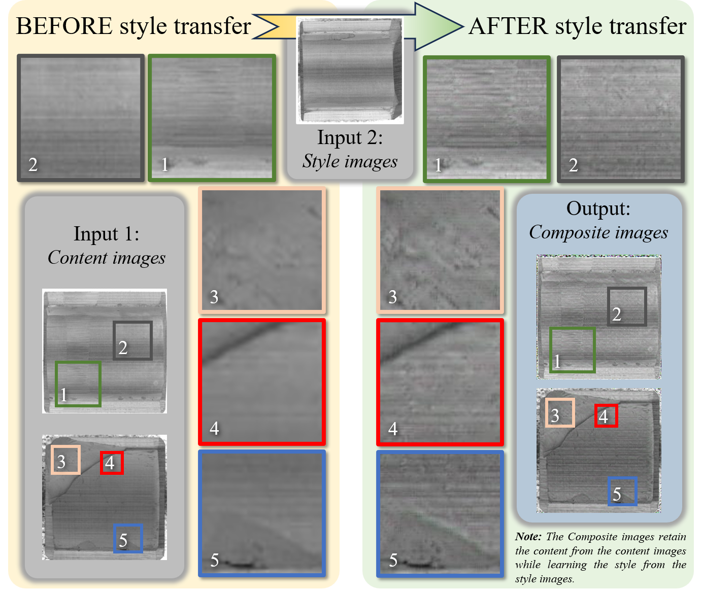
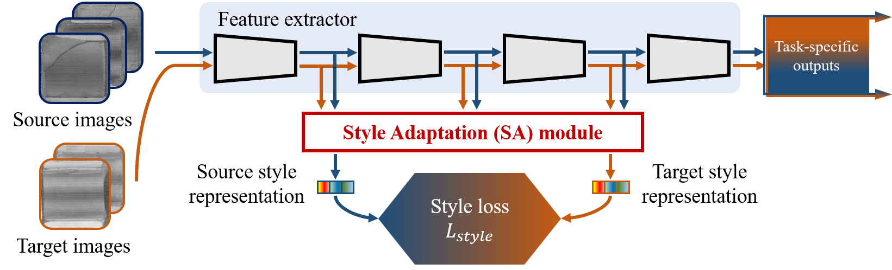
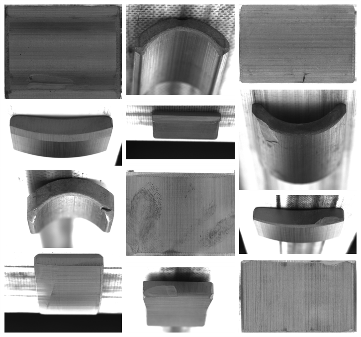

## Brief Introduction

To address the domain shift issue among data from different sources in the industrial domain, we present a novel plug-and-play Style Adaptation (SA) module, which endows the equipped defect detector with the capability to exhibit robustness to diverse styles present within the samples. This module effectively leverages datasets sourced from diverse origins while possessing congruent data types. In contrast to other domain adaptation approaches lacking well-defined domain delineations, the SA module generates representations characterized by distinct practical implications and precise mathematical formulations. Moreover, incorporating attention mechanisms reduces the need for manual intervention, allowing the module to focus autonomously on crucial branches in it.

Experimental results demonstrate the superior efficacy of our approach compared to state-of-the-art techniques.

## Highlights

- Introduce a dataset for magnetic tile surface defect detection sourced from various manufacturers.
- Propose a domain adaptation method with a clear and meaningful “domain”.
- Integrate the method in a plug-and-play module, maintaining the original network’s inference speed.

## Basic Idea

Style can be employed to describe the differences between samples from various sources.

<div align=center><br/><ie><small>
    Basic idea of SA module.
</small></ie></div>

## Implementation

<div align=center><br/><ie><small>
    Implementation details of the SA module.
</small></ie></div>

## Dataset

A **self-constructed magnetic tile dataset** is chosen to utilize as the experimental dataset, which was collected from four actual factory production lines.

- Could be download [here](https://github.com/THU-PMVAI/MTS3D).

<div align=center><br/><ie><small>
    Samples from different manufacturers exhibit numerous differences in various aspects: actual shape variations of magnetic tiles, background differences and contrast discrepancies resulting from different shooting angles used to present different tile surfaces.
</small></ie></div>

## Codes

`To be updated`

## Citation

```
@article{LI2024104084,
title = {Style Adaptation module: Enhancing detector robustness to inter-manufacturer variability in surface defect detection},
journal = {Computers in Industry},
volume = {157-158},
pages = {104084},
year = {2024},
issn = {0166-3615},
doi = {https://doi.org/10.1016/j.compind.2024.104084},
url = {https://www.sciencedirect.com/science/article/pii/S0166361524000125},
author = {Chen Li and Xiakai Pan and Peiyuan Zhu and Shidong Zhu and Chengwei Liao and Haoyang Tian and Xiang Qian and Xiu Li and Xiaohao Wang and Xinghui Li},
keywords = {Surface defect detection, Domain adaptation, Style transfer},
abstract = {In recent years, deep learning-based approaches for industrial surface defect detection have shown great promise. To address the domain shift issue among data from different sources in the industrial domain, we present a novel plug-and-play Style Adaptation (SA) module, which endows the equipped defect detector with the capability to exhibit robustness to diverse styles present within the samples. This module effectively leverages datasets sourced from diverse origins while possessing congruent data types. In contrast to other domain adaptation approaches lacking well-defined domain delineations, the SA module generates representations characterized by distinct practical implications and precise mathematical formulations. Moreover, incorporating attention mechanisms reduces the need for manual intervention, allowing the module to focus autonomously on crucial branches in it. Experimental results demonstrate the superior efficacy of our approach compared to state-of-the-art techniques. Furthermore, an authentic dataset from various manufacturers is publicly available for deep learning research and industrial applications. Access the dataset at: https://github.com/THU-PMVAI/MTS3D}
}
```
